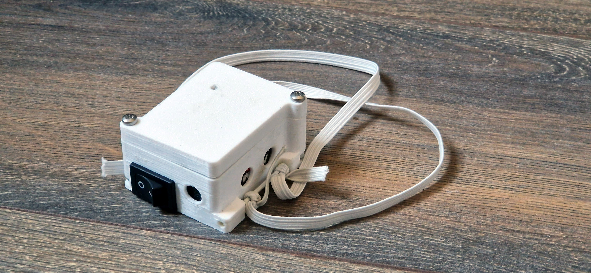

# ⚠️Under development⚠️ 

# KickTracker

Arduino based embedded system for collecting acceleration data of hitting pads, from taekwondo techniques.

# ⭐ Acknowledgements
The design of the case is based on the design by SnailSale (https://www.thingiverse.com/thing:3408080)
